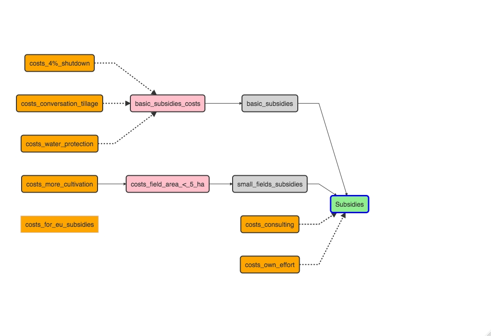
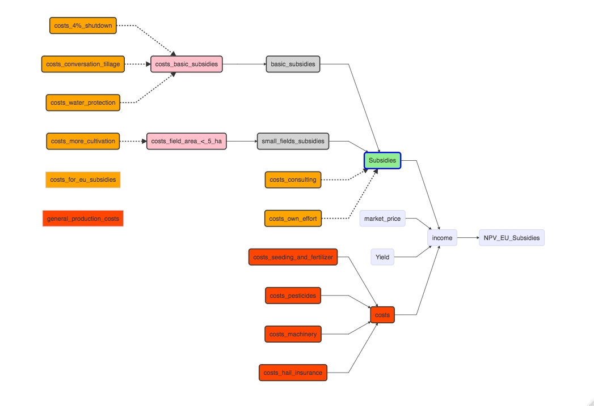

README
================

# EU Subsidies/ No EU Subsidies?

## Motivation 

We decided to look into the question: “Is it economically he right decision to follow the EU guidelines to get the subsidies?”
Because of the new regulations in Germany that determine how much subsidies are paid, there are some farmers who are thinking about giving up the subsidies in order to have more control over their production methods.
The new regulations are quite complicated, depending on the type of farm the crops and also the age of the farmer. 
One aspect of this issue is whether these regulations really have a positive impact on the ecological status of agroecosystems and whether they can be calculated or monetized to include them in calculations in the model. However, we think that the consideration are too extensive for this course.

## Background 

The current period is marked by many major crises at the international level. Agriculture is also affected by this. 
Currently, the Common Agricultural Policy (CAP) is being fundamentally reformed.
The aim of the new CAP is to make agriculture sustainable and climate-friendly. Thus, a new common CAP should contribute to the set environmental and climate goals of the European Union.
Small farms are also to be strengthened. Furthermore, the EU member states should be given more flexibility to adapt their domestic agricultural policies to local conditions. 

### Change of the subsidy payment

In order to achieve the newly set goals, there will be a change in the payment of EU subsidies. Until now, only the requirements of the fertilizer regulation in Germany had to be met in order to receive subsidies.  Environmental requirements and thus agronomic measures were not linked to the payment of subsidies. Also, the basis premiums were reduced by almost 60%. 

### Principle of conditionality

In the new CAP, the principle of "conditionality" is planned. 
This means that in the future, EU subsidies will only be paid out if conditions are fulfilled. These conditions can severely restrict the farmer in his agronomic possibilities and can have a strong impact on the farm's success. 

## Uncertainties

With the reduction of subsidies combined with new costly regulations, many farmers are currently asking themselves whether there are still advantages to using subsidies. 
To answer this question, many factors, often unpredictable, must be considered. 

For one thing, production conditions change very quickly. Prices for fertilizer, machinery, seeds, crop protection, fuel are currently subject to extreme fluctuations.  These can be subject to very rapid changes due to wars or crises such as the Corona pandemic. 
Likewise, the yield can change quickly due to a changing climate and the yield level is not stable.  
Furthermore, the prices that farmers pay for their products are not stable and are subject to sharp price jumps. Here, a look at the past shows that prices can rise or fall within a very short period of time. 
Depending on the uncertainties described here, mandatory measures that must be implemented in the future in order to receive subsidies will have a differentiated impact on the success of each farm. 

## Flow Chart 

The chart below outlines a scenario in which the farmer chooses to receive the base premium and the premium paid for a maximum field size. 

In order to receive both premiums, costs are incurred under the principle of conditionality. This cost is incurred through agronomic cuts. The costs are colored orange. 

This section illustrates this. 

Red colored are the costs, which can be regarded as general production costs.

## Model function

The model function is executed twice. Once the receipt of subsidies is simulated and the expected profit is calculated under the premise that subsidies are paid and the necessary cuts and their costs are accepted. In the second variant, only the profit to be expected if no subsidies are paid is calculated. It should be noted here that in this case there are also no costs for the subsidies

