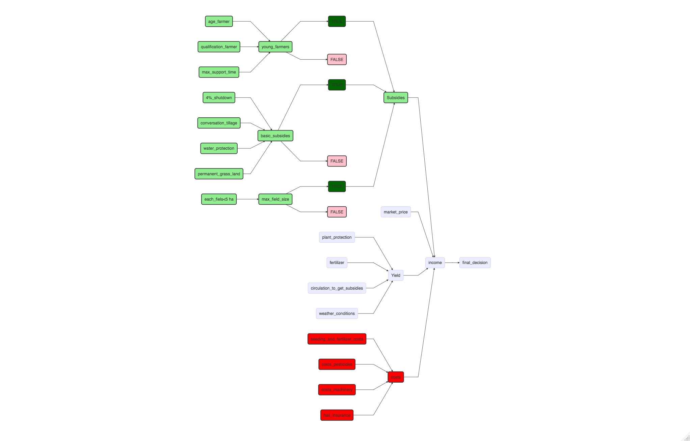

README
================

# EU Subsidies/ No EU Subsidies?

We decided to look into the question: “Is it economically he right decision to follow the EU guidelines to get the subsidies?”
Because of the new regulations in Germany that determine how much subsidies are paid, there are some farmers who are thinking about giving up the subsidies in order to have more control over their production methods.
The new regulations are quite complicated, depending on the type of farm the crops and also the age of the farmer. 
One aspect of this issue is whether these regulations really have a positive impact on the ecological status of agroecosystems and whether they can be calculated or monetized to include them in calculations in the model. However, we think that the consideration are too extensive for this course.

