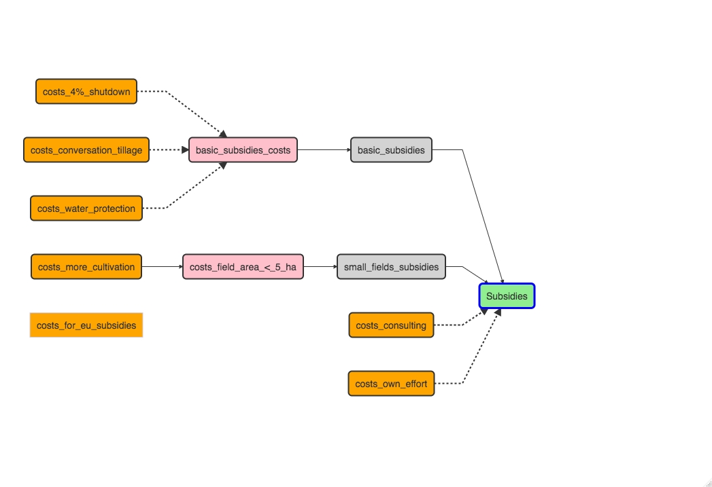

```{r setup, include=FALSE}
knitr::opts_chunk$set(echo = TRUE)
```

## History of EU Subsidies 

When the European Community was founded, the six founding countries agreed on
a common agricultural policy (CAP). The first agricultural subsidies, which mostly reached
producers indirectly in the form of intervention prices or export refunds, began to
flow in 1962. Since 1992, price supports have been gradually converted into direct
payments and disbursed in a manner decoupled from the crops (Garzon 2006). 


## Current situation

The current period is marked by many major crises at the international level. Agriculture is also affected by this. 
Currently, the CAP is being fundamentally reformed.
The aim of the new CAP is to make agriculture sustainable and climate-friendly. Thus, a new common CAP should contribute to the set environmental and climate goals of the European Union.
Small farms are also to be strengthened. Furthermore, the EU member states should be given more flexibility to adapt their domestic agricultural policies to local conditions. To this end, new decisions on direct payments will come into force as of January 2023. 

### Change of the subsidy payment


In order to achieve the newly set goals, there will be a change in the payment of EU subsidies. Until now, only the requirements of the fertilizer regulation in Germany had to be met in order to receive subsidies.  Environmental requirements and thus agronomic measures were not linked to the payment of subsidies. Also, the basis premiums were reduced by almost 60%. 


### Principle of conditionality

In the new CAP, the principle of "conditionality" is planned. 
This means that in the future, EU subsidies will only be paid out if conditions are fulfilled. These conditions can severely restrict the farmer in his agronomic possibilities and can have a strong impact on the farm's success. 


## Uncertainties


With the reduction of subsidies combined with new costly regulations, many farmers are currently asking themselves whether there are still advantages to using subsidies. 
To answer this question, many factors, often unpredictable, must be considered. 

For one thing, production conditions change very quickly. Prices for fertilizer, machinery, seeds, crop protection, fuel are currently subject to extreme fluctuations.  These can be subject to very rapid changes due to wars or crises such as the Corona pandemic. 
Likewise, the yield can change quickly due to a changing climate and the yield level is not stable.  
Furthermore, the prices that farmers pay for their products are not stable and are subject to sharp price jumps. Here, a look at the past shows that prices can rise or fall within a very short period of time. 
Depending on the uncertainties described here, mandatory measures that must be implemented in the future in order to receive subsidies will have a differentiated impact on the success of each farm. 

## Flow Chart 


The chart below outlines a scenario in which the farmer chooses to receive the base premium and the premium paid for a maximum field size. 
In order to receive both premiums, costs are incurred under the principle of conditionality. This cost is incurred through agronomic cuts. The costs are colored orange. Red colored are the costs, which can be regarded as general production costs.

__This section illustrates this:__ 



Red colored are the costs, which can be regarded as general production costs.


## Model function

The model function is executed twice. Once the receipt of subsidies is simulated and the expected profit is calculated under the premise that subsidies are paid and the necessary cuts and their costs are accepted. In the second variant, only the profit to be expected if no subsidies are paid is calculated. It should be noted here that in this case there are also no costs for the subsidies


#### Input Data 
Let's first take a look at the input data to be passed to the model function. 
The table shown here is only an excerpt. The column in which each variable is described is not represented. Furthermore, only the first 6 rows are shown. The complete input table can be found in the git repository, which you can find [here](https://github.com/PhilippAusgust/EU_Subsidies).


```{r,echo=FALSE}
library(readr)
ddd <- read.csv2("Input_new.csv")
library(readxl)

mod <- read_excel("Modified_Table.xlsx")

head(mod)
```


## Build Function


```{r}


subsidies_decision_function <- function(x, varnames){
  
  # define variables with constant distribution
  
  farming_area_               <- rep(farm_size, n_years)
  eu_subsidies_basic          <- rep(eu_subsidies, n_years)
  eu_subsidies_small_fields   <- rep(small_fields, n_years)
  
  # define each variable with variation over the period of 6 years
  
  # income factors 
  wheat_price     <- vv(price_wheat, var_CV, n_years)
  wheat_yield     <- vv(yield_wheat, var_CV, n_years)
  
  # general cost per ha 
  costs_fer_seeds <- vv(seeding_fertilizer_costs,var_CV, n_years)
  costs_pest      <- vv(costs_pesticides,var_CV, n_years)
  costs_machy     <- vv(costs_machinery, var_CV, n_years)
  costs_insur     <- vv(hail_insurance, var_CV, n_years)
  
  # costs to get subsidies
  
  costs_consult               <- vv(cunsult_costs,var_CV,n_years)
  costs_shut_down             <- vv(costs_shutdown,var_CV,n_years)
  costs_conversation          <- vv(costs_cns_tillage, var_CV,n_years)
  costs_realize_small_fields  <- vv(more_cultivation_costs,var_CV, n_years)
  costs_own_effort            <- vv(own_efforts_costs,var_CV, n_years)
  
  # define arrays for the final result of Net Present Value
  
  net_subsidies <- rep(0, n_years)
  net_no_subsidies <- rep(0, n_years)
  
 
  
  # Preliminary calculation of the value of base EU subsidies and subsidies for 
  # limiting each arable 
  # area in the farm to a maximum of 5 ha.
  
  basic_subsidies_small_fields_subsidies <- (farming_area_*eu_subsidies_basic
                                             +farming_area_*eu_subsidies_small_fields)
  # calculate risk in case the application for EU subsidies is completed 
  # and processed but not finally submitted
  
  planned_to_get_subsidies_but_not_realized <- chance_event(risk_, 1, 0, n = 1)
  
  # At this point the case distinction begins Decision for or against subsidies 
  
  for (decison_get_eu_subsidies in c(FALSE,TRUE)){
    
  # get eu subsidies 
    
    if (decison_get_eu_subsidies){
      
      get_eu_subsidies <- TRUE
      application_costs <- TRUE 
      
    }
    
    # get no eu subsidies
    
    else{
      
      get_eu_subsidies <- FALSE
      application_costs <- FALSE 
      
    }
    
    # if the application is made and not submitted application costs are generated 
      if (planned_to_get_subsidies_but_not_realized){
      
      get_eu_subsidies <- FALSE
      
    }
    # create an array for the consulting costs incurred annually
    cost_application <- rep(0, n_years)
    
    # calculation of annual consulting and application costs
    if (application_costs){
      cost_application <- (costs_consult+costs_own_effort)*farming_area_
    }
 
    # create array for annual consulting and application costs
    # create array for the annual brutto income from the subsidies 
    annual_costs_subsidies <- rep(0,n_years)
    benefits_eu_subsidies  <- rep(0,n_years)
  
    
    if (get_eu_subsidies){
      
      # costs incurred for the application  
      annual_costs_subsidies <- cost_application
    
      # subsidies potentially paid out by the application 
      benefits_eu_subsidies  <- basic_subsidies_small_fields_subsidies
    }
    
      # array for arable costs incurred due to requirements for receiving EU subsidies.
    opportunity_costs_subsedies <- rep(0, n_years)
    
    if(get_eu_subsidies){
      # calculate arable costs incurred due to requirements for receiving EU subsidies.
      opportunity_costs_subsedies <- ((costs_shut_down+costs_conversation+costs_realize_small_fields)
                                      *farming_area_)
    
    }
    
      
    
    
    # final profit calculation with subsidies 
    if(get_eu_subsidies){ 
      
      total_benefits <-  benefits_eu_subsidies + farming_area_*(wheat_price*wheat_yield)
      net_subsidies <-  (total_benefits - farming_area_*(costs_fer_seeds +costs_pest+costs_machy +costs_insur)
                         -opportunity_costs_subsedies)
      
    }
    
    else{
    # final profit calculation without subsidies 
      net_no_subsidies <-  (farming_area_*(wheat_price*wheat_yield) 
                                          -farming_area_*(costs_fer_seeds +costs_pest+costs_machy +costs_insur))
      
    
    }
    
  }
    
    # End of for loop
    
    # Include inflation
  
  NPV_subsidies<-
    discount(net_subsidies, discount_rate, calculate_NPV = TRUE)

  NPV_no_subsidies <-
    discount(net_no_subsidies, discount_rate, calculate_NPV = TRUE)

  return(list(
    NPV_subsidies = NPV_subsidies,
    NPV_no_subsidies = NPV_no_subsidies,
    NPV_subsidies = NPV_subsidies - NPV_no_subsidies,
    Cashflow_decision_do = net_subsidies - net_no_subsidies
  ))
    
}


```


